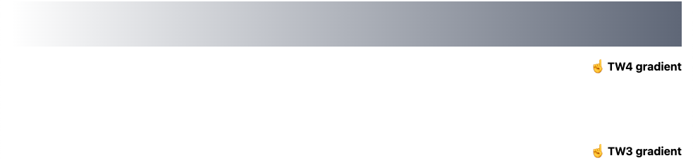

# Tailwind v4.1.5 bug report

This page demonstrates an issue that occurs when a component library with Tailwind 3 generated styles is used in an app with Tailwind 4 styles.

In theory, the Tailwind 3 styles have their own prefix (`tw3-`) and are loaded into the `components` CSS cascade layer, so they should not interfere with the Tailwind styles in the consuming app.

In practice, Tailwind 4 registers `--tw-gradient-from` as a `@property` that must contain a `&lt;color&gt;` value, but in the Tailwind 3 generated styles, `--tw-gradient-from` contains a color followed by a percentage (`#6b7280 var(--tw-gradient-from-position)`). This value is discarded by the browser as invalid, which breaks the TW3-generated gradient.

A fix for this could be to change the name of the variable in TW4 to something that doesn't clash with TW3, like `--tw-gradient-from-color`.

## Preview

This is what the reproduction looks like in a browser:



## How to run

Install dependencies:

```sh
pnpm i
```

Build the app styles:

```sh
pnpm build
```

Open the **index.html** file in a browser.

## How it works

The app build runs Tailwind 4 to build **./dist/styles.css** based on **./styles.css**. This stylesheet `@import`s the styles from a pretend UI library whose styles are built with Tailwind 3, **./tw3-package/dist/styles.css**.

You can re-run the build of that package's styles if you want to by running `pnpm build` in the **tw3-package** subdirectory, but this is not necessary as the build output is included in this repo.
